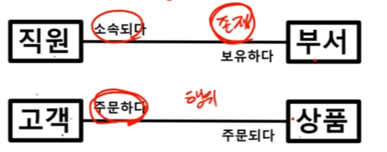

[**이기적 SQLD 이론 강의**](https://www.youtube.com/watch?v=64c0BgeCLAY&t=1s)  

## 관계 (Relationship)  

엔터티 내의 인스턴스들 간에 **서로 논리적인 연관성**이 있는 상태.

> 엔터티와 인스턴스   
>> 엔터티: 현실에 있는 집합을 단순 명사화 한 것  
>> 인스턴스: 엔터티 내의 엔트리들 - 엔터티라는 집합의 구성  

### 관계의 분류  

존재와 행위에 의한 관계가 있다.  

존재에 의한 관계: 직원은 부서에 소속된다  
행위에 의한 관계: 고객은 상품을 주문한다  

- ERD는 존재/행위 등 관계를 위처럼 똑같이 표시한다. 

> ERD  
>> Entity Relation Diagram  
>> 엔터티끼리의 관계를 이용하여 그린 그림  

- UML 클래스다이어그램은, 연간관계(존재)는 실선으로 표기하고, 의존관계(행위)는 점선으로 표시한다.  

시험에서는 '다음 관계의 분류에 대해 올바르지 않은 경우는?' 등으로 나오며, 말장난 수준으로 나온다. (예: 존재에 의한 관계는 점선이다.)  

### 관계를 표시하는 방법  

표기하는 방식에 따라 IE와 Barker 표기법으로 구분된다.  
- 시험에서는 IE가 대부분 나온다.  

ERD에서의 선(관계)은 세 가지 방식으로 표현된다:  

- 관계명(Membership)
- 관계차수(Cardinality/Degree)
- 관계선택사양(Optionality)  

1. 관계명을 표시한다. 이때, 애매한 동사나 과거형은 피한다.  

직원이 부서에 소속되어있다, 부서가 직원을 보유하고있다  

*IE와 Barker 모두 표기방식 동일*  

2. 관계차수는 엔터티 내 각 인스턴스들이 얼마나 참여하는지를 의미한다.  

1:1, 1:M, M:N 등  

[!관계차수](https://mblogthumb-phinf.pstatic.net/MjAxODExMTlfMjE3/MDAxNTQyNjM4Mjk2MDg4.EmvBgBtbc0lT4BZPnZ8uxsXUAB0g2w1ywkkf8hCS8C0g.zuCjeQTS814lsqwUfglO2XPR0RePTEzi9tCvK7hu2wwg.PNG.qbxlvnf11/ERD-Notation.PNG?type=w800)   

IE 표기방식에서는 위와 같은 형태로 관계차수를 표현한다. 

반면, Barker 표기방식은 1의 의미를 별도로 표현하지 않는다.  

[!차이1](https://velog.velcdn.com/images/mjieun/post/fad96a6f-f246-41a1-b7a3-781df8fde6e4/image.png)    
[!차이2](https://velog.velcdn.com/images/mjieun/post/4f2665e3-1e4b-47c9-959a-0cdd0d82672a/image.png)  

3. 관계선택사양은 엔터티 내 각 인스턴스들이 필수/선택 참여하는지를 의미한다.  

[!erddiagram](https://file.notion.so/f/f/d6bf389f-51e5-4356-b4a7-6b4bd35c1d89/dc53bd14-688b-4c51-83c3-f7ad6f2db4b0/Untitled.png?id=712a5cdc-4f2c-4a1b-a0b3-8c60419da21f&table=block&spaceId=d6bf389f-51e5-4356-b4a7-6b4bd35c1d89&expirationTimestamp=1722384000000&signature=ZPsLjZ0F-uGe4omZ39qFRRv4VgbDlPMKhuh66YTj6Ig&downloadName=Untitled.png)  

[!difference](https://file.notion.so/f/f/d6bf389f-51e5-4356-b4a7-6b4bd35c1d89/ec9807a9-0883-4e1c-9089-f242d2e35dc1/Untitled.png?id=42061f47-feb2-4cab-8886-93a8bd482a50&table=block&spaceId=d6bf389f-51e5-4356-b4a7-6b4bd35c1d89&expirationTimestamp=1722384000000&signature=2Zth3tr3ZP_MccHgAKTNWDaYHZ8-TGwOqNtHotVUOKM&downloadName=Untitled.png)  

Barker 표기법에서는 1관계는 표현하지 않으며, 0에 대한 표기는 반대쪽을 점선으로 표현한다.   

