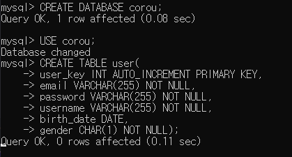
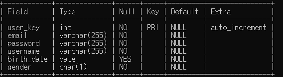
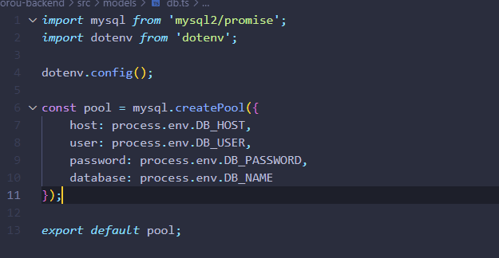
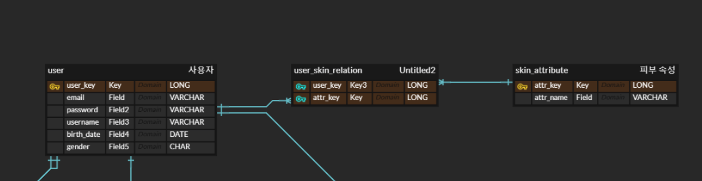
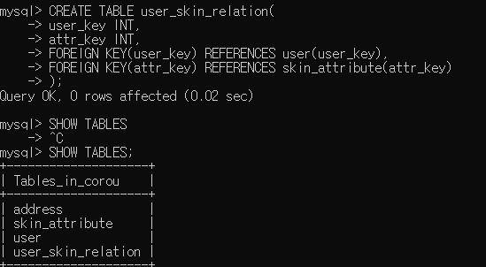

## 다시  

바빴던 2주가 지나갔다. 다행히 자격증 시험도 무난하게 합격한 것 같고, 통역도 잘 마무리하여 코딩에 집중할 시간이 확보됐다.  

그동안 SQL을 열심히 공부했으니 실전에서 사용할 때가 된 것 같다. 자격증을 준비할 때는 실습을 할 기회가 없었어서 인터넷을 뒤져서 사용법을 찾아봤는데, 기존에 MongoDB도 CLI로 조작을 했어서 그런지 큰 어려움 없이 사용할 수 있었다.  

  

  
*지금 보니 생년월일에 NOT NULL을 넣는 것을 깜빡했다*

사용자 테이블을 만들고, 만들어뒀던 서버 코드에서 이를 접근 가능하도록 만들었다.  

   

개인 테스팅을 하여 익숙해진 뒤 클라우드에 올려 같이 작업하는 프론트 쪽에서도 접근이 가능하게 해야겠다는 생각이 들어, MongoDB Atlas와 같은 클라우드 서비스가 mySQL로 존재하는지 찾아보니 AWS RDS와 heroku를 많이 사용하는 것 같아서 이를 사용할 예정이다.  

## 관계  

외래키를 가져오는 방법과 관계의 카디널리티를 설정하는 방법 또한 확인해보았다.  

외래키는 두 가지 방법으로 등록할 수 있으며 첫 방법은 다음과 같이 설정을 할 수 있다:  

- 부모 테이블 생성
  
```sql
CREATE TABLE user(
    user_key INT AUTO_INCREMENT PRIMARY KEY,
    email VARCHAR(255) NOT NULL,
    password VARCHAR(255) NOT NULL,
    username VARCHAR(255) NOT NULL,
    birth_date DATE,
    gender CHAR(1) NOT NULL);
```

- 자식 테이블 생성 시 외래키 설정하여 생성 
  
```sql
mysql> CREATE TABLE address(
    addr_key INT AUTO_INCREMENT PRIMARY KEY,
    user_key INT,
    name VARCHAR(255) NOT NULL,
    zip INT NOT NULL,
    addr VARCHAR(255) NOT NULL,
    addr_detail VARCHAR(255) NOT NULL,
    tel VARCHAR(255) NOT NULL,
    req VARCHAR(255),
    is_default CHAR(1),
    FOREIGN KEY (user_key) REFERENCES user(user_key)
);
```  

두 번째 방법은 이미 생성한 테이블에 추가하는 방법이다:  

- 자식 테이블 생성
```sql
mysql> CREATE TABLE address(
    addr_key INT AUTO_INCREMENT PRIMARY KEY,
    user_key INT,
    name VARCHAR(255) NOT NULL,
    zip INT NOT NULL,
    addr VARCHAR(255) NOT NULL,
    addr_detail VARCHAR(255) NOT NULL,
    tel VARCHAR(255) NOT NULL,
    req VARCHAR(255),
    is_default CHAR(1),
);
```  

- 외래키 추가 
```sql
ALTER TABLE address
ADD CONSTRAINT fk_user
FOREIGN KEY (user_key) REFERENCES user(user_key);  
```
  

  

캡쳐된 엔터티들이 제대로 생성된 것을 볼 수 있다.  

---